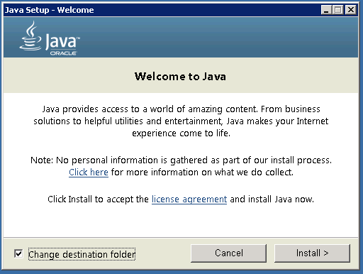
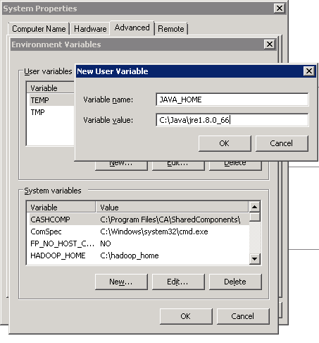
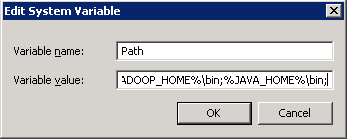
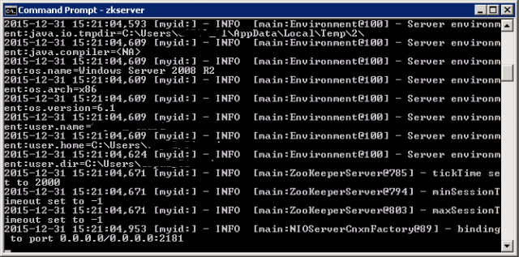
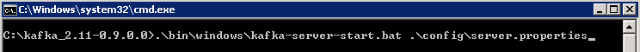
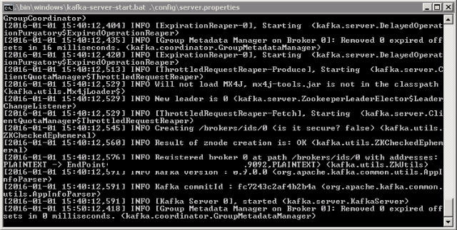
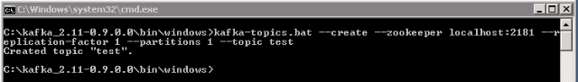
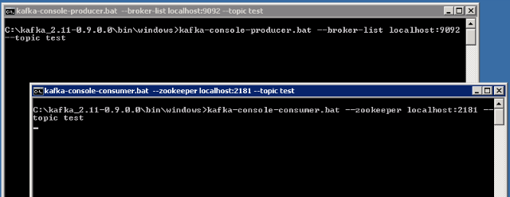

# Running Apache Kafka on Windows

In this lecture, we will learn how to run Apache Kafka on a windows OS. This guide will also provide instructions to setup Java & zookeeper.

## Downloading the Required Files

1. Download Server JRE according to your OS & CPU architecture from http://www.oracle.com/technetwork/java/javase/downloads/jre8-downloads-2133155.html
2. Download and install 7-zip from http://www.7-zip.org/download.html
3. Download & extract Zookeeper using 7-zip from http://zookeeper.apache.org/releases.html
4. Download & extract Kafka using 7-zip from http://kafka.apache.org/downloads.html

## Installation

### a. Install & Setup Java Runtime Environment (JRE)
1. Start JRE installation and hit the check box “Change destination folder”, then click install.

2. Change the installation directory to any path without spaces in folder name. Ex C:\Java\jre1.8.0_xx\. (By default it will be C:\Program Files\Java\jre1.8.0_xx) then click Next.
3. Now open system environment variables dialogue by opening Control Panel -> System -> Advanced system settings -> Environment Variables…
4. Hit New… button in User variables section then type <code>JAVA_HOME</code> in Variable name & give your jre path in Variable value. It should look like:

(Java path and version may change according to the version of Kafka you are using)

5. Now click ok.
6. Search for Path variable in the “System Variable” section in “Environment Variables” dialogue box you just opened.
7. Edit the path and type <code>“;%JAVA_HOME%\bin”</code> at the end of the text already written there just like image below:

8. To confirm java installation just open cmd and type <code>“java –version”</code>, you should be able to see version of the java you just installed.

If your command prompt some what looks like the image above, you are good to go. Else you need to recheck whether your setup version is matching with OS architecture (x86, x64) or environment variables path is correct in or not.

### b. Installing & Running Zookeeper
1. Goto your zookeeper config directory. For me its C:\zookeeper-3.4.7\conf
2. Rename file “zoo_sample.cfg” to “zoo.cfg”
3. Open zoo.cfg in any text editor like notepad but I’ll prefer notepad++.
4. Find & edit dataDir=/tmp/zookeeper to dataDir=C:\zookeeper-3.4.7\data
5. Add entry in System Environment Variables as we did for java
..*Add in System Variables ZOOKEEPER_HOME = C:\zookeeper-3.4.7
    b. Edit System Variable named “Path” add <code>;%ZOOKEEPER_HOME%\bin;</code>
6. You can change the default zookeeper port in zoo.cfg file (Default port 2181).
7. Run zookeeper by opening a new cmd & type zkserver.
8. You will see the command prompt with some details like image below.

Congratulations your zookeeper is up & running on port 2181.

### c. Setting Up Kafka
1. Go to your Kafka config directory. For me its C:\kafka_2.11-0.9.0.0\config
2. Edit file “server.properties”
3. Find & edit line “log.dirs=/tmp/kafka-logs” to “log.dir= C:\kafka_2.11-0.9.0.0\kafka-logs”.
4. If your zookeeper is running on some other machine or cluster you can edit “zookeeper.connect=localhost:2181” to your custom IP & port. For this demo we are using same machine so no need to change. Also Kafka port & broker.id are configurable in this file. Leave other settings as it is.
5. Your Kafka will run on default port 9092 & connect to zookeeper’s default port which is 2181.

### d. Running Kafka Server
<code>Note: Please ensure that your zookeeper is up & running before starting Kafka server.</code>
1. Go to your kafka installation directory C:\kafka_2.11-0.9.0.0\
2. Open a command prompt here by pressing Shift + right click and choose “Open command window here” option)
3. Now type <code>.\bin\windows\kafka-server-start.bat .\config\server.properties</code> & press enter.

If everything went fine your command prompt will look like this one

Now your Kafka is up & running, so now you can create topics & produce or consume data from java/scala code & command prompt also.

### e. Creating Kafka Topic
1. Now create a topic with name “test” & replication factor 1 as we have only one Kafka server running. If you have a cluster with more than 1 Kafka servers running, you can increase the replication-factor accordingly which will increase the data availability & act like a fault-tolerant system.
2. Open a new command prompt in the location C:\kafka_2.11-0.9.0.0\bin\windows
3. Type following command and hit enter
<code>kafka-topics.bat --create --zookeeper localhost:2181 --replication-factor 1 --partitions 1 --topic test</code>

### f. Creating a producer & consumer to test server 
1. Open a new command prompt in the location C:\kafka_2.11-0.9.0.0\bin\windows
2. To start a producer type command “kafka-console-producer.bat --broker-list localhost:9092 --topic test”.
3. Again open a new command prompt in the same location as C:\kafka_2.11-0.9.0.0\bin\windows
4. Now start a consumer by typing command “kafka-console-consumer.bat --zookeeper localhost:2181 --topic test”.
5. Now you will have two command prompts like image below

Now type anything in the producer command prompt & press enter and you should be able to see the message in the other consumer command prompt.

If you are able to push & see your messages in consumer side, you are done with Kafka setup.

## Some Other Useful Commands
1. List Topics: <code>kafka-topics.bat --list --zookeeper localhost:2181</code>
2. Describe Topic: <code>kafka-topics.bat --describe --zookeeper localhost:2181 --topic [Topic Name]</code>
3. Read messages from beginning: <code>kafka-console-consumer.bat --zookeeper localhost:2181 --topic [Topic Name] --from-beginning</code>
4. Delete Topic: <code>kafka-run-class.bat kafka.admin.TopicCommand --delete --topic [topic_to_delete] --zookeeper localhost:2181</code>
## Reference Links
1. http://kafka.apache.org/documentation.html
2. https://zookeeper.apache.org/doc/trunk/zookeeperStarted.html

